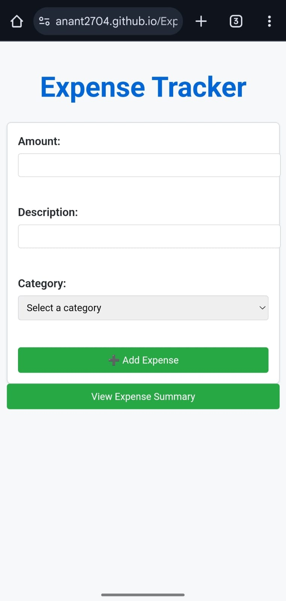

(summary.jpg)

## About the Project

**Expense Tracker** is a simple and intuitive application designed to help users manage and track their daily expenses. This project allows users to add, view, and manage their expenses efficiently, providing overview into their financial habits.

---

## Features

- Add new expenses with details such as category, amount, date, and description.
- View a comprehensive list of all recorded expenses.
- Generate and download expense reports for better financial management.
- User-friendly interface with a responsive design.

---

## Technologies Used

- Frontend: HTML, CSS
- Backend: Javascript
- Database: IndexedDB

---

## To Try..

To run this web application:

Run this link - https://anant2704.github.io/Expense-Tracker/

