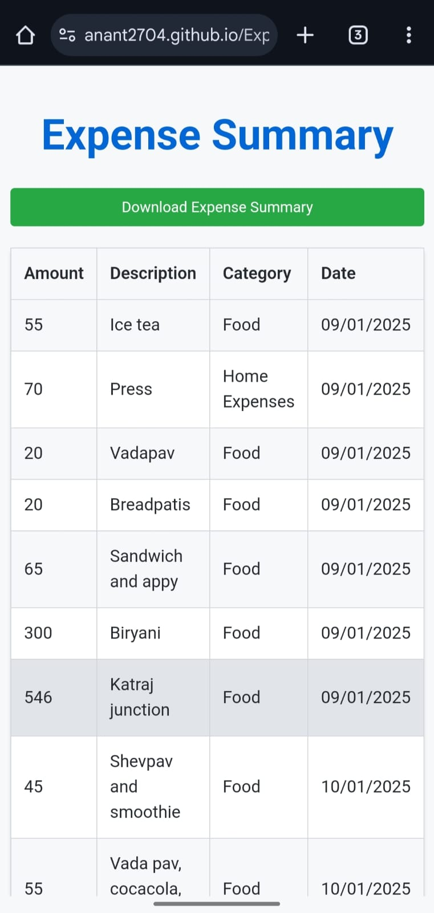

# Expense Tracker

## About the Project

**Expense Tracker** is a simple and intuitive application designed to help users manage and track their daily expenses. This project allows users to add, view, and manage their expenses efficiently, providing an overview into their financial habits.

---

## Features

- Add new expenses with details such as category, amount, date, and description.
- View a comprehensive list of all recorded expenses.
- Generate and download expense reports for better financial management.
- User-friendly interface with a responsive design.

---

## Technologies Used

- Frontend: HTML, CSS
- Backend: Javascript
- Database: IndexedDB

---

## To Try..

To run this web application:

- Visit: [Expense Tracker](https://anant2704.github.io/Expense-Tracker/)

### Screenshots

- **Home Page**
  {:width="400px" height="300px"}

- **Summary Page**
  {:width="400px" height="300px"}

---

## Contributing

If you would like to contribute to this project, feel free to fork the repository and submit a pull request. 
---

## Contact

- **Author**: Anant Joshi 
- **GitHub**: [anant2704](https://github.com/anant2704)  

---
